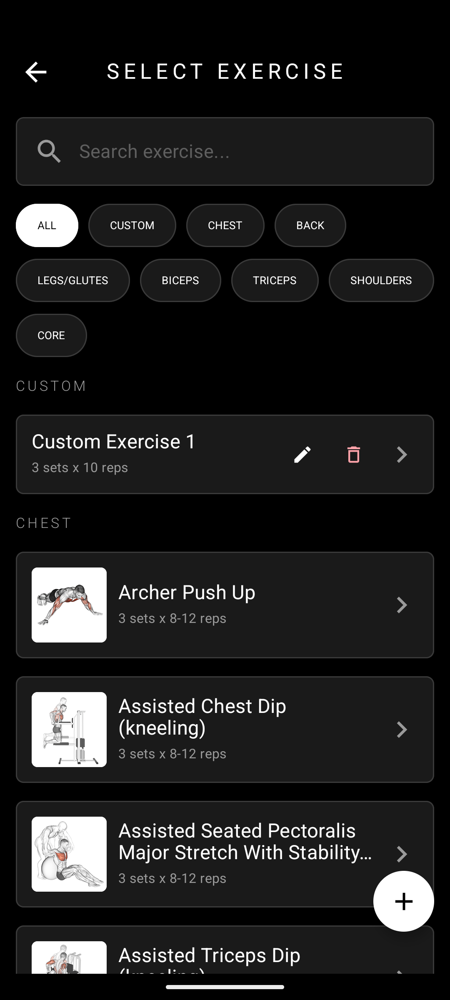
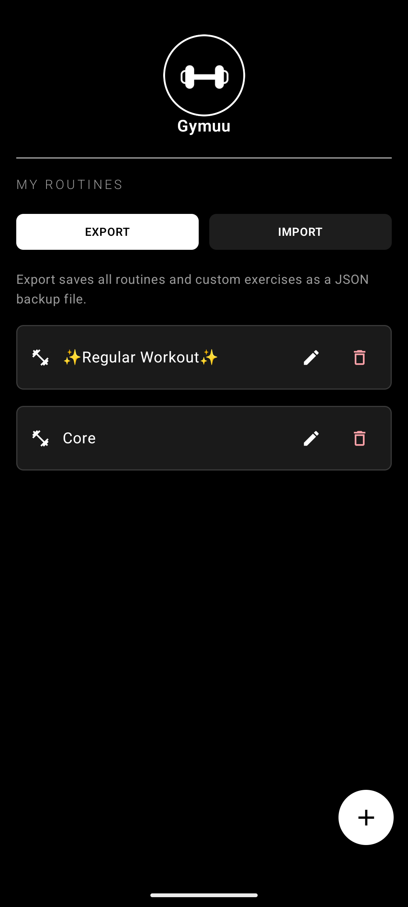

<p align="center">
  
</p>

<h1 align="center">Gymuu</h1>

<p align="center">
  A minimal, offline-first gym workout tracker built with Jetpack Compose.
  <br />
  Create routines, organize workout days, choose exercises, and track sets, reps, weight, rest, and notes.
</p>

<p align="center">
  
  
  
  
  
</p>

---

## Features

### Exercise GIF Previews
- **Built-in exercise demos** - bundled exercise records include remote GIF URLs for visual previews.
- **Coil GIF loading** - GIFs are rendered with Coil using ImageDecoder on API 28+ and GifDecoder fallback on older supported devices.
- **Smart image caching** - a shared Coil image loader uses memory caching plus a 256 MB disk cache to reduce repeat network loading.
- **Graceful fallback** - missing or failed GIFs show a simple exercise placeholder.

<table align="center">
  <tr>
    <td></td>
    <td></td>
  </tr>
</table>

### Routine Management
- **Create and manage routines** - add, rename, delete, export, and import routines from the routine list.
- **Multi-day workouts** - each routine can contain multiple workout days with swipe paging and previous/next controls.
- **Day controls** - add, rename, or remove workout days while staying inside the active routine.
- **Navigation drawer** - switch routines or jump back to routine management from the workout screen.

<p align="center">
  
</p>

### Workout Tracking
- **Sets, reps, and weight** - track each set with editable reps and weight fields.
- **Set completion** - check off completed sets as you train.
- **Rest timer** - completing a set can start a rest countdown, with vibration feedback when the timer finishes.
- **Notes** - store per-exercise notes for cues, setup details, or reminders.
- **Exercise ordering** - move exercises up or down, delete individual exercises, or swap them for another exercise.
- **Bulk actions** - select multiple exercises to copy, cut, paste, or delete across workout days.

### Exercise Library
- **1,300+ built-in exercises** - exercise metadata is loaded from a bundled JSON asset and parsed once at startup.
- **Search** - find exercises by name, body part, equipment, target muscle, or secondary muscle.
- **Category filters** - browse All, Custom, Chest, Back, Legs/Glutes, Biceps, Triceps, Shoulders, and Core.
- **Exercise details** - view body parts, equipment, target muscles, secondary muscles, and instructions for built-in exercises.
- **Custom exercises** - create, edit, and delete your own exercises with name, set count, reps, and rest defaults.
- **Add or swap** - add exercises to a workout day or swap an existing routine exercise from the same picker.

<table align="center">
  <tr>
    <td></td>
    <td></td>
  </tr>
</table>

Category filters are applied to the bundled exercise JSON like this:

| Selected category | Exercise JSON match |
|---|---|
| **All** | No category filter; shows all built-in exercises that match the search text. |
| **Custom** | Shows local custom exercises only; custom search matches the custom exercise name. |
| **Chest** | `bodyParts` contains `chest`, or `targetMuscles` contains `pectorals`, or `secondaryMuscles` contains `chest`. |
| **Back** | `bodyParts` contains `back`, or `targetMuscles` contains `lats`, `upper back`, or `spine`. |
| **Legs/Glutes** | `bodyParts` contains `upper legs` or `lower legs`, or `targetMuscles` contains `glutes`, `quads`, `hamstrings`, `calves`, or `abductors`. |
| **Biceps** | `targetMuscles` or `secondaryMuscles` contains `biceps`. |
| **Triceps** | `targetMuscles` or `secondaryMuscles` contains `triceps`. |
| **Shoulders** | `bodyParts` contains `shoulders`, or `targetMuscles` contains `delts`, or `secondaryMuscles` contains `shoulders`. |
| **Core** | `bodyParts` contains `waist`, or `targetMuscles` contains `abs`, or `secondaryMuscles` contains `core` or `obliques`. |


### Data and Backup
- **Offline-first workout data** - routines and custom exercises are stored locally with SharedPreferences.
- **Bundled exercise metadata** - the core exercise library ships with the app; only remote GIF previews need network access.
- **Versioned backups** - export all routines and custom exercises as JSON.
- **Merge imports** - imported routines are added alongside existing routines, while duplicate custom exercises are deduplicated by content signature.

<p align="center">
  
</p>

---

## Key Design Decisions

| Decision | Rationale |
|---|---|
| **Single-activity, Compose-only UI** | Navigation Compose handles the app flow without fragments. |
| **SharedPreferences storage** | Keeps the app lightweight with no database dependency; `PersistedAppState` provides a versioned JSON format. |
| **Bundled exercise JSON** | The exercise library is available without a live API and is cached in memory after startup parsing. |
| **Coil for GIF previews** | Provides animated GIF rendering and a shared 256 MB disk cache for remote exercise demos. |
| **0.9x density scaling** | `APP_SCALE` in `MainActivity` slightly shrinks the UI so workout controls fit more comfortably on screen. |
| **JSON import/export** | Backups remain readable, portable, and easy to merge across devices. |

---

## Getting Started

### Prerequisites

- **Android Studio**
- **JDK 11** or higher
- **Android SDK** with API 36 installed

### Build & Run

```bash
# Clone the repository
git clone https://github.com/JitishxD/gymuu.git
cd gymuu

# Build a debug APK
./gradlew assembleDebug

# Install on a connected device/emulator
./gradlew installDebug
```

On Windows, use `.\gradlew.bat assembleDebug` and `.\gradlew.bat installDebug`.

You can also open the project in Android Studio and click **Run**.

### Release Build

The release build type has code shrinking (`isMinifyEnabled`) and resource shrinking (`isShrinkResources`) enabled with ProGuard:

```bash
./gradlew assembleRelease
```

Configure signing in Android Studio or in `app/build.gradle.kts` before producing a distributable signed APK.

---

## Screens

| Screen | Description |
|---|---|
| **Routine Launch** | Loading screen that opens the first available routine day. |
| **Routine List** | Manage routines, create new routines, and export/import JSON backups. |
| **Workout Day** | Main workout view with day paging, routine drawer navigation, exercise cards, set tracking, rest timer, notes, and bulk actions. |
| **Select Exercise** | Browse, search, filter, add, swap, and manage custom exercises. |

---

## Contributing

1. Fork the repository
2. Create a feature branch (`git checkout -b feature/awesome-feature`)
3. Commit your changes (`git commit -m 'feat: add awesome feature'`)
4. Push to the branch (`git push origin feature/awesome-feature`)
5. Open a Pull Request

---

## License

This project is currently unlicensed. All rights reserved by the author.

---

<p align="center">
  Made with care by <a href="https://github.com/JitishxD">Jitish</a>
</p>
