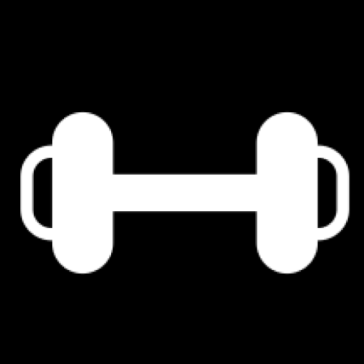
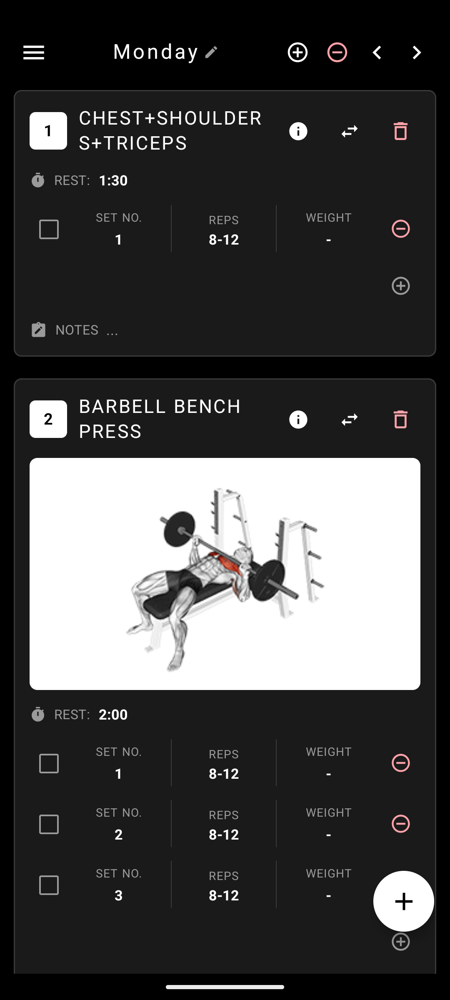
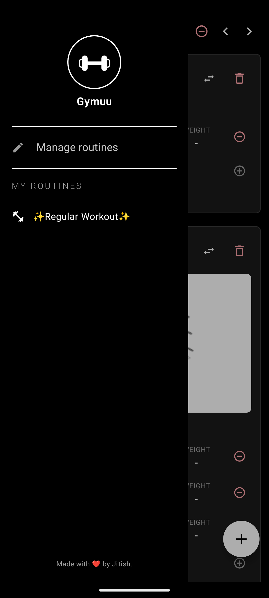
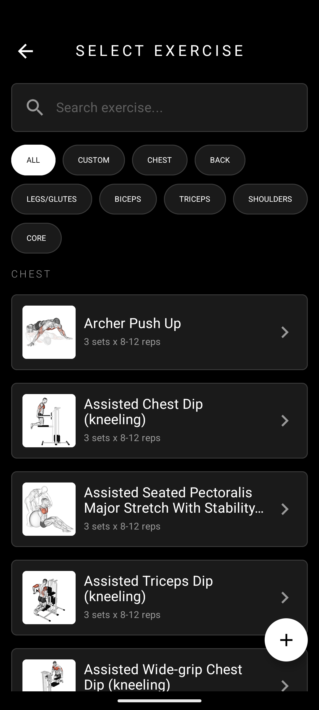

<p align="center">
  
</p>

<h1 align="center">Gymuu</h1>

<p align="center">
  A minimal, offline-first gym workout tracker built with Jetpack Compose.
  <br />
  Create routines, organize workout days, track sets &amp; reps — all from your pocket.
</p>

<p align="center">
  
  
  
  
  
</p>

---

## ✨ Features

### Media Support
- **Animated GIF previews** — built-in exercises display animated GIF demonstrations loaded from the web.
- **Custom exercise media** — attach images, GIFs, or short videos (≤ 30s) from your phone or via direct URL.
- **Video playback** — inline video player with fullscreen mode, powered by ExoPlayer (Media3).
- **Smart caching** — 256 MB disk cache for both images (Coil) and videos (ExoPlayer) to minimize bandwidth usage.

<p align="center">
  
</p>


### Routine Management
- **Create & organize routines** — build named workout routines with multiple days (e.g. Push Day, Pull Day, Legs & Core).
- **Multi-day workouts** — each routine supports multiple workout days, navigable via horizontal swipe paging.
- **Rename & delete** — easily edit routine and day names, or remove them entirely.
- **Navigation drawer** — quickly switch between routines from any workout screen.

<p align="center">
  
</p>

### Exercise Library
- **1,300+ built-in exercises** — a comprehensive database loaded from a bundled JSON asset, searchable by name, body part, equipment, and muscle group.
- **Category filtering** — filter exercises by Chest, Back, Shoulders, Legs/Glutes, Biceps, Triceps, Core, or view custom exercises only.
- **Exercise info dialog** — view detailed instructions, target muscles, secondary muscles, equipment, and body parts for any built-in exercise.
- **Custom exercises** — create your own exercises with a name, default sets/reps/rest, and optional media (image, GIF, or video).

<p align="center">
  
</p>

### Workout Tracking
- **Sets, reps & weight** — track individual sets with inline-editable reps and weight fields.
- **Set completion** — check off sets as you complete them.
- **Rest timer** — automatic countdown timer triggered on set completion, with haptic vibration feedback when rest is over.
- **Notes** — add per-exercise notes for form cues or reminders.
- **Swap exercises** — swap any exercise in your routine for a different one, preserving your existing sets.

### Data & Backup
- **Offline-first** — all data is stored locally via SharedPreferences. No account or internet connection required.
- **Export/Import** — export all routines and custom exercises as a versioned JSON backup file, and import them on any device.
- **Merge imports** — imported routines are added alongside existing ones; duplicate custom exercises are deduplicated by content signature.

---

### Key Design Decisions

| Decision | Rationale |
|---|---|
| **Single-activity, Compose-only** | Leverages Navigation Compose for all routing; no fragments. |
| **SharedPreferences for storage** | Keeps the app lightweight with zero database dependencies. A versioned JSON schema (`PersistedAppState`) handles migrations. |
| **Bundled exercise JSON** | The ~1.4 MB asset file is parsed once at startup and cached in-memory, avoiding network calls for the core library. |
| **0.9x density scaling** | `APP_SCALE` in `MainActivity` slightly shrinks the UI to fit more content on screen — a deliberate density override. |
| **ExoPlayer (Media3) for video** | Provides reliable playback with disk caching for web-sourced exercise videos. |
| **Coil for images/GIFs** | Efficient image loading with GIF animation support (ImageDecoder on API 28+, GifDecoder fallback). |

---

## 🚀 Getting Started

### Prerequisites

- **Android Studio** 
- **JDK 11** or higher
- **Android SDK** with API 36 installed

### Build & Run

```bash
# Clone the repository
git clone https://github.com/JitishxD/gymuu.git
cd gymuu

# Build a debug APK
./gradlew assembleDebug

# Install on a connected device/emulator
./gradlew installDebug
```

Or simply open the project in Android Studio and click **Run ▶️**.

### Release Build

The release build type has code shrinking (`isMinifyEnabled`) and resource shrinking (`isShrinkResources`) enabled with ProGuard:

```bash
./gradlew assembleRelease
```

> **Note:** You'll need to configure a signing key in `app/build.gradle.kts` or via `keystore.properties` before building a signed release APK.

---

## 📱 Screens

| Screen | Description |
|---|---|
| **Routine Launch** | Splash/loading screen that auto-navigates to the first routine's first day. |
| **Workout Day** | Main workout view with swipeable day pager, exercise cards, set tracking, and rest timer. |
| **Routine List** | Manage all routines — create, edit, delete, export, and import backups. |
| **Select Exercise** | Browse and search the exercise library with category filters; add or swap exercises. |

---

## 🤝 Contributing

1. Fork the repository
2. Create a feature branch (`git checkout -b feature/awesome-feature`)
3. Commit your changes (`git commit -m 'feat: add awesome feature'`)
4. Push to the branch (`git push origin feature/awesome-feature`)
5. Open a Pull Request

---

## 📄 License

This project is currently unlicensed. All rights reserved by the author.

---

<p align="center">
  Made with ❤️ by <a href="https://github.com/JitishxD">Jitish</a>
</p>
